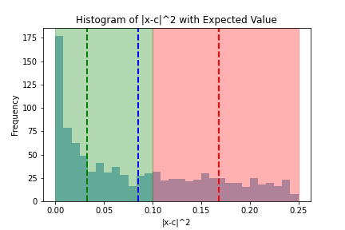

[](http://quantlet.de/)

## [](http://quantlet.de/) **PS1codes** [](http://quantlet.de/)

```yaml

Name of QuantLet : 'PS1codes'

Published in : 'Cross-Section-and-Panel-Data-H' 

Description : 'Coding for the PS1 exercise class for 2024 Cross-Section-and-Panel-Data-H'

Keywords : 'Simulation , Chebyshev'

Author : 'Xiaorui ZUO'

Submitted : Wed, Mar 27 2024

```




### [IPYNB Code: PS1codes.ipynb](PS1codes.ipynb)


automatically created on 2024-03-28